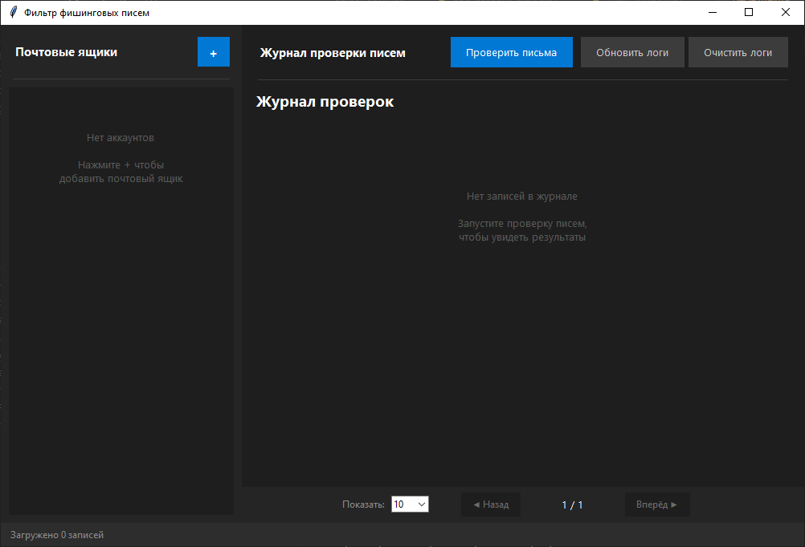
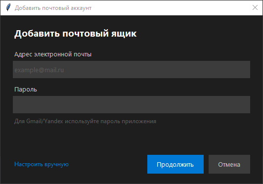
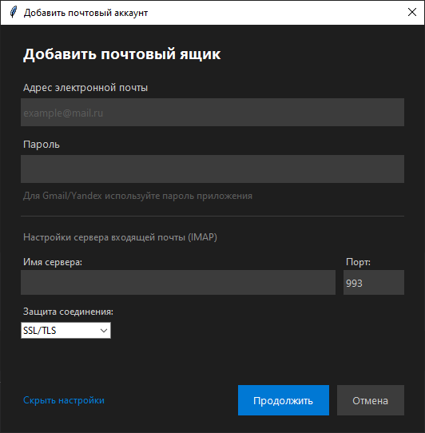
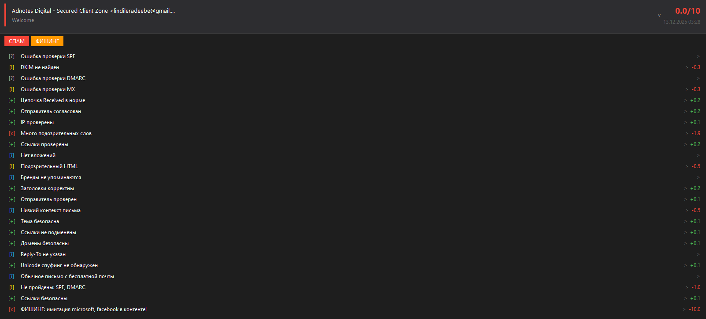
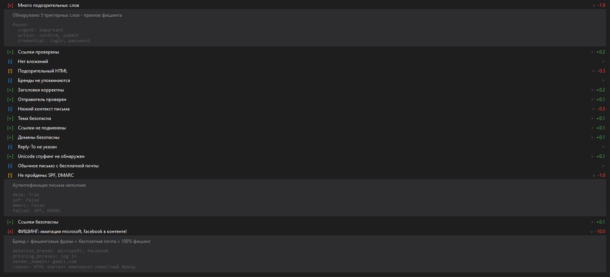
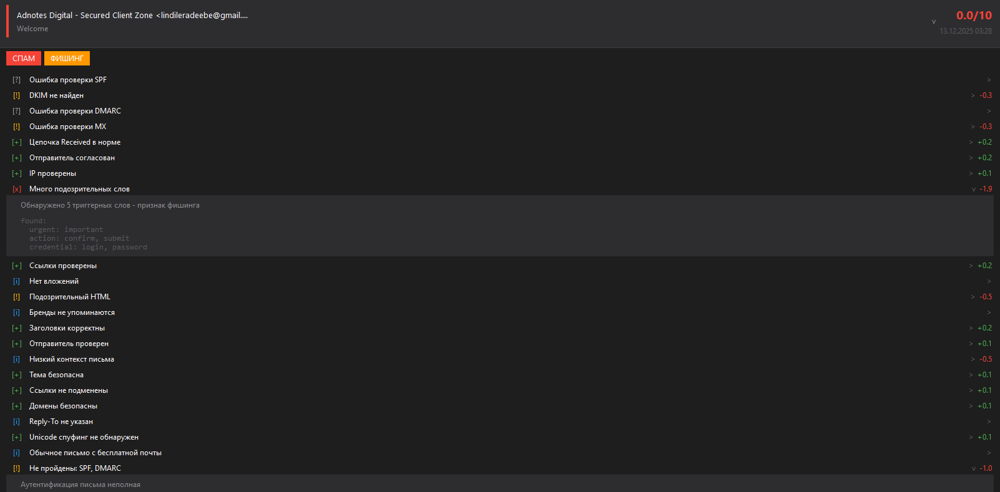

# 📧 Анализатор фишинговых писем v2.0

Программа для автоматического анализа входящих писем на предмет **фишинга** и **спама** с удобным графическим интерфейсом.

---

## 📖 Словарь терминов (для новичков)

### Что такое фишинг?

**Фишинг** — это вид интернет-мошенничества, когда злоумышленники притворяются известными компаниями (банками, Google, Steam и т.д.) и пытаются обманом получить ваши личные данные: пароли, номера карт, логины.

**Пример:** Вам приходит письмо от "Steam Support <scammer123@gmail.com>" с текстом "Ваш аккаунт заблокирован, введите пароль для восстановления". Это фишинг, потому что настоящий Steam никогда не будет писать с бесплатной почты Gmail.

### Что такое спам?

**Спам** — это нежелательные массовые рассылки, обычно рекламного характера. Спам отличается от фишинга тем, что не пытается украсть ваши данные, но тоже засоряет почту.

---

### 🌐 DNS (Domain Name System)

**DNS** — это как телефонная книга интернета. Когда вы набираете "google.com", компьютер обращается к DNS, чтобы узнать IP-адрес (цифровой адрес) этого сайта.

**Простая аналогия:** Представьте, что DNS — это справочная служба. Вы называете имя человека (google.com), а вам дают его номер телефона (142.250.185.14).

**Зачем это нужно в проверке писем?** DNS хранит специальные записи, которые подтверждают, что отправитель письма — настоящий, а не мошенник.

---

### 📋 SPF (Sender Policy Framework)

**Что это:** SPF — это записка от владельца домена, где написано: "Только эти серверы могут отправлять почту от моего имени".

**Простая аналогия:** Представьте, что вы владеете компанией и написали охраннику список сотрудников, которым разрешено отправлять письма от имени компании. Если кто-то не из списка попробует отправить письмо от вашего имени — его отклонят.

**Как работает проверка:**
- ✅ **SPF пройден** — письмо отправлено с разрешённого сервера
- ⚠️ **SPF не настроен** — домен не защитил себя от подделки
- ❌ **SPF провален** — письмо пришло с неавторизованного сервера (возможно, подделка!)

---

### 🔐 DKIM (DomainKeys Identified Mail)

**Что это:** DKIM — это цифровая подпись письма, которая подтверждает, что письмо действительно отправлено владельцем домена и не было изменено по пути.

**Простая аналогия:** Представьте, что вы отправляете письмо с личной печатью. Получатель может проверить печать и убедиться, что:
1. Письмо действительно от вас
2. Никто не вскрыл конверт и не изменил содержимое

**Как работает:**
- Отправитель "подписывает" письмо специальным ключом
- Получатель проверяет подпись через DNS
- Если подпись верна — письмо подлинное

**Результаты проверки:**
- ✅ **DKIM пройден** — подпись верна, письмо подлинное
- ⚠️ **DKIM не найден** — домен не использует подписи
- ❌ **DKIM провален** — подпись неверна, письмо могло быть подделано

---

### 🛡️ DMARC (Domain-based Message Authentication, Reporting & Conformance)

**Что это:** DMARC — это политика домена, которая говорит почтовым серверам, что делать с письмами, не прошедшими проверки SPF и DKIM.

**Простая аналогия:** DMARC — это инструкция для охранника: "Если кто-то пытается пройти без пропуска (SPF/DKIM), что делать?"
- **none** — пропустить, но записать в журнал
- **quarantine** — задержать в карантине (папка "Спам")
- **reject** — не пропускать вообще

**Результаты проверки:**
- ✅ **DMARC reject** — строгая защита, поддельные письма отклоняются
- ✅ **DMARC quarantine** — поддельные письма попадают в спам
- ⚠️ **DMARC none** — только мониторинг, без защиты
- ❌ **DMARC отсутствует** — домен не защищён от подделки

---

### 📮 MX (Mail Exchange)

**Что это:** MX записи показывают, какие серверы принимают почту для данного домена.

**Простая аналогия:** MX — это адрес почтового отделения компании. Если у компании нет почтового отделения, значит она не может получать письма — подозрительно!

**Зачем проверять:**
- У легитимных доменов всегда есть MX записи
- Если MX записей нет — домен может быть поддельным или созданным только для рассылки

---

### 🔄 Return-Path / Envelope Sender

**Что это:** Return-Path — это "обратный адрес" письма, куда приходят уведомления о недоставке.

**Простая аналогия:** Когда вы отправляете обычное письмо, на конверте пишете адрес отправителя. Return-Path — это и есть тот адрес на "конверте" email.

**Почему это важно:** Мошенники часто указывают в поле "От кого" красивое имя (например, "Google Security"), но настоящий Return-Path выдаёт их реальный адрес.

---

### 🔗 URL (Uniform Resource Locator)

**Что это:** URL — это адрес страницы в интернете (например, https://google.com/search).

**Опасные URL:**
- **URL-сокращатели** (bit.ly, tinyurl.com) — скрывают реальный адрес
- **IP вместо домена** (http://185.45.67.89/) — обычно вредоносные сайты
- **Подозрительные домены** (.xyz, .tk, .top) — часто используются мошенниками
- **Омографические атаки** — gооgle.com (с русской "о" вместо латинской)

---

### 🎭 Unicode-спуфинг (Омографическая атака)

**Что это:** Замена латинских букв на похожие символы из других алфавитов (например, кириллицы).

**Пример:** Слово "security" может быть написано как "ѕесuritу", где:
- "ѕ" — это кириллическая буква, похожая на "s"
- "е" — кириллическая, похожая на латинскую "e"
- "у" — кириллическая, похожая на латинскую "y"

**Зачем это делают:** Чтобы обмануть фильтры и заставить вас думать, что письмо о "security" (безопасности) — настоящее.

---

### 📎 IMAP (Internet Message Access Protocol)

**Что это:** Протокол для доступа к почте на сервере. Позволяет программам читать ваши письма.

**Простая аналогия:** IMAP — это ключ от почтового ящика. Вы даёте программе этот ключ, и она может заглянуть внутрь и прочитать письма.

---

## 🆕 Возможности версии 2.0

### 🔄 Автоматическая проверка писем

Программа может автоматически проверять новые письма в фоновом режиме:

- **Настройка:** нажмите кнопку ⚙ (шестерёнка) на карточке аккаунта
- **Включение/выключение:** в диалоге настроек установите галочку "Включить автоматическую проверку"
- **Интервал:** настраивается для каждого аккаунта отдельно (от 5 секунд до 1 часа)
- **Работа в фоне:** просто откройте программу и забудьте про кнопки — фишинг будет перемещаться в спам автоматически

### Критические проверки (100% детекция фишинга)

| Проверка | Что обнаруживает |
|----------|------------------|
| **Unicode-спуфинг** | Замена латинских букв на кириллические ("ѕесuritу" вместо "security") |
| **Бренд + бесплатная почта** | "Steam Support <scammer@gmail.com>" = 100% фишинг |
| **Подмена ссылок** | Текст показывает google.com, а href ведёт на malware.xyz |
| **Вредоносные URL** | Ссылки на известные вредоносные домены |
| **Authentication-Results** | Анализ результатов аутентификации от Gmail/Outlook |

### Базовые проверки

| Категория | Проверки |
|-----------|----------|
| **DNS** | SPF, DKIM, DMARC, MX записи |
| **Контент** | Триггерные слова, опасные ссылки, вложения |
| **HTML** | Опасные теги, скрытые элементы, формы для паролей |
| **Заголовки** | Return-Path, X-Mailer, Received chain |
| **Отправитель** | Подмена бренда, несоответствие имени и домена |

---

## 📊 Система оценки риска

Каждое письмо получает балл от 0 до 10:

| Уровень | Баллы | Цвет | Действие |
|---------|-------|------|----------|
| 🟢 **Безопасное** | 8-10 | Зелёный | Можно читать |
| 🔵 **Низкий риск** | 6-8 | Голубой | Незначительные предупреждения |
| 🟡 **Средний риск** | 4-6 | Жёлтый | Будьте внимательны |
| 🟠 **Высокий риск** | 2-4 | Оранжевый | Не переходите по ссылкам |
| 🔴 **Критический** | 0-1 | Красный | Фишинг! Перемещается в спам |

---

## 💻 Установка

### Требования
- Python 3.8 или новее
- Windows / macOS / Linux

### Шаги установки

```bash
# 1. Откройте папку проекта
cd mpa

# 2. Установите зависимости
pip install -r requirements.txt
```

### Запуск программы

```bash
python main.py
```

---

## 🖥️ Интерфейс программы

### Главное окно



---

## ⚙️ Настройка почтовых аккаунтов

### Gmail

1. **Включите IMAP:**
   - Откройте Gmail → Настройки (⚙️) → "Все настройки"
   - Вкладка "Пересылка и POP/IMAP"
   - Включите "Доступ по протоколу IMAP"

2. **Создайте пароль приложения:**
   - Перейдите на [myaccount.google.com](https://myaccount.google.com)
   - Безопасность → Двухэтапная аутентификация (должна быть включена!)
   - Пароли приложений → Создать
   - Выберите "Почта" и ваше устройство
   - Скопируйте 16-значный пароль

3. **В программе:**
   - Email: ваш@gmail.com
   - Пароль: 16-значный пароль приложения
   - IMAP сервер: imap.gmail.com (определится автоматически)

### Mail.ru

1. Настройки → Все настройки → Почтовые программы
2. Включите "Доступ по IMAP"
3. Создайте пароль для внешних приложений
4. В программе используйте этот пароль

### Yandex

1. Настройки → Все настройки → Почтовые программы
2. Включите "Доступ по IMAP"
3. Включите "Пароли приложений" в настройках безопасности
4. Создайте пароль для приложения

### Другие почтовые сервисы

Программа автоматически определяет IMAP-сервер для популярных сервисов. Для остальных укажите вручную:
- **IMAP сервер:** обычно imap.domain.com
- **Порт:** 993 (SSL/TLS) или 143 (STARTTLS)

### Добавление аккаунта в программу

Просто введите email и пароль — программа автоматически определит настройки почтового сервера:



Если нужно указать настройки вручную, нажмите "Настроить вручную":



---

### Карточка письма (развёрнутая)

При клике на письмо показываются все найденные проблемы с подробным описанием каждой проверки:



### Подробные результаты проверок

Каждую проверку можно раскрыть для просмотра деталей:





---

## 📁 Структура проекта

```
mpa/
├── main.py                    # Точка входа (запуск программы)
├── requirements.txt           # Зависимости Python
├── accounts.json              # Сохранённые аккаунты (создаётся автоматически)
│
├── analyzer/                  # 🔍 Модуль анализа писем
│   ├── email_analyzer.py      # Главный анализатор (все проверки v2.0)
│   ├── content_analyzer.py    # Анализ контента (текст, ссылки, вложения)
│   ├── dns_checker.py         # DNS проверки (SPF, DKIM, DMARC, MX)
│   ├── analysis_result.py     # Классы результатов и логгер
│   └── data_loader.py         # Загрузчик данных из JSON
│
├── core/                      # ⚙️ Ядро приложения
│   ├── config.py              # Конфигурация (IMAP серверы, порты)
│   ├── models.py              # Модели данных (EmailAccount)
│   └── account_manager.py     # Менеджер аккаунтов
│
├── gui/                       # 🖼️ Графический интерфейс
│   ├── main_window.py         # Главное окно
│   ├── add_account_dialog.py  # Диалог добавления аккаунта
│   ├── log_viewer.py          # Просмотрщик логов
│   ├── widgets.py             # Кастомные виджеты
│   └── styles.py              # Стили и цвета
│
├── imap/                      # 📬 IMAP клиент
│   └── client.py              # Подключение к почтовым серверам
│
├── data/                      # 📊 Данные для анализа
│   ├── known_brands.json      # Известные бренды и их домены
│   ├── suspicious_tlds.json   # Подозрительные TLD (.xyz, .tk)
│   ├── trigger_words.json     # Триггерные слова (срочно, угрозы)
│   ├── dangerous_extensions.json  # Опасные расширения файлов
│   ├── imap_hosts.json        # IMAP серверы популярных почт
│   └── error_messages.json    # Сообщения об ошибках
│
└── logs/                      # 📝 Логи анализа
    └── {email}/               # Папка для каждого аккаунта
        └── *.json             # Результаты проверок
```

---

## 🔒 Безопасность

### Хранение данных
- 🔐 Пароли хранятся **локально** в файле `accounts.json`
- 🔒 Пароли кодируются в Base64 (не шифрование, но скрывает от случайного просмотра)
- 💡 **Рекомендация:** Используйте пароли приложений, а не основной пароль

### Что программа НЕ делает
- ❌ Не отправляет ваши данные на внешние серверы
- ❌ Не сохраняет содержимое писем (только метаданные и результаты анализа)
- ❌ Не удаляет письма (только перемещает в папку "Спам")

### Сетевая активность
Программа выполняет только:
1. **IMAP подключения** к вашим почтовым серверам
2. **DNS запросы** для проверки SPF/DKIM/DMARC (публичная информация)

---

## 🛠️ Конфигурация

### accounts.json

```json
{
  "accounts": [
    {
      "email": "user@gmail.com",
      "password": "base64_encoded_password",
      "host": "imap.gmail.com",
      "port": 993,
      "security": "SSL/TLS",
      "enabled": true,
      "auto_check": false,
      "check_interval": 30
    }
  ]
}
```

### Поля аккаунта

| Поле | Тип | По умолчанию | Описание |
|------|-----|--------------|----------|
| `email` | string | — | Email адрес |
| `password` | string | — | Пароль в кодировке Base64 |
| `host` | string | auto | IMAP сервер (определяется автоматически) |
| `port` | number | 993 | Порт подключения |
| `security` | string | "SSL/TLS" | Тип защиты: "SSL/TLS", "STARTTLS", "Нет" |
| `enabled` | boolean | true | Включена ли фильтрация для аккаунта |
| `auto_check` | boolean | false | Включена ли автоматическая проверка |
| `check_interval` | number | 30 | Интервал автопроверки в секундах |

### Типы защиты соединения

| Тип | Порт | Безопасность | Рекомендация |
|-----|------|--------------|--------------|
| **SSL/TLS** | 993 | 🟢 Высокая | ✅ Рекомендуется |
| **STARTTLS** | 143 | 🟡 Средняя | Если нет SSL |
| **Нет** | 25 | 🔴 Низкая | ❌ Не использовать |

---

## ❓ Частые вопросы (FAQ)

### Почему письмо от Google/Microsoft помечено как фишинг?

Проверьте адрес отправителя. Настоящие письма от Google приходят с доменов:
- `@google.com`
- `@accounts.google.com`
- `@notifications.google.com`

Если письмо пришло с `@gmail.com` с официальным именем — это фишинг!

### Программа помечает легитимные письма как опасные

Такое может случаться, если:
1. У отправителя не настроены SPF/DKIM/DMARC
2. Письмо содержит много ссылок или "триггерных" слов
3. Письмо переслано через несколько серверов

Проверяйте детали анализа — там указано, какие проверки не прошли.

### Как создать пароль приложения для Gmail?

1. Откройте [myaccount.google.com](https://myaccount.google.com)
2. Перейдите в "Безопасность"
3. Включите "Двухэтапную аутентификацию" (если не включена)
4. Найдите "Пароли приложений"
5. Создайте пароль для "Почта" — "Windows Computer"
6. Используйте полученный 16-значный код в программе

### Почему нужен пароль приложения, а не обычный?

Google (и другие сервисы) блокируют доступ через обычный пароль для сторонних приложений. Пароль приложения:
- 🔒 Работает только для конкретного приложения
- 🔒 Можно отозвать в любой момент
- 🔒 Не даёт полный доступ к аккаунту

---

## 📞 Поддержка

Если у вас возникли проблемы:

1. **Проверьте логи** в папке `logs/`
2. **Убедитесь**, что пароль приложения введён правильно
3. **Проверьте**, что IMAP включён в настройках почты

---

## 📜 Лицензия

Проект создан в образовательных целях. Используйте на свой страх и риск.

---

*Версия 2.0 • 2025*
